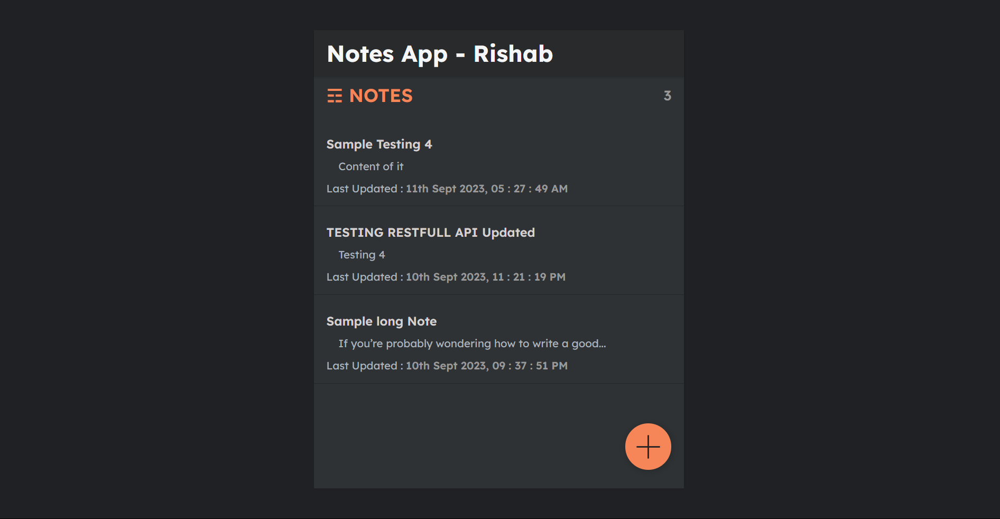

# NotesApp - Fullstack Project

<u><b>Technical Details :</b></u>

* Frontend : ReactJS
* Backend : Django
* Connectivity(API) : REST Framework

 

 

<u><b>Dependencies :</b></u>

* Python
* Django
* djangorestframework
* django-cors-headers

 

 

<u><b>Sample Output :</b></u>

